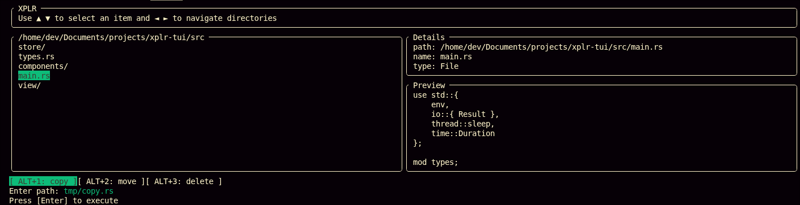

# xplr-tui

A file manager TUI in `rust`.



---

## usage

1. run the prorgam `cargo run /path/to/directory` (development)
2. navigate through the directory content and select a file or a directory with `ARROW_UP` and `ARROW_DOWN`
3. if the selected item is a directory, use `ARROW_RIGHT` to view its content, `ARROW_LEFT` to go back to the previous directory
4. use `ALT + $NUMBER` to start a command (copy, move, rename, delete), cancel action with same `ALT + $NUMBER` combination (workflow not implemented)
   - copy: `ALT + 1`
   - rename: `ALT + 2`
   - move: `ALT + 3`
   - delete: `ALT + 4`

#### not implemented

Following use cases may throw errors as not implemented:

- permissions
- logs, error messages

#### to do

- search files content and directory content to match names
- sort items
- commands workflow to copy, move, rename and delete items (only rendering with placeholder)
- load new directory from a path

---

---

## requirements

|         |                                 |
| ------- | ------------------------------- |
| `rustc` | `1.91.1 (ed61e7d7e 2025-11-07)` |
| `cargo` | `1.91.1 (ed61e7d7e 2025-11-07)` |

#### systems

- Linux `x86_64` with `6.18.8` kernel

---

---

## development

```sh
# fetch root directory content
cargo run

# fetch directory for /path/to/directory
cargo run /path/to/directory

# build
cargo build
```

---

---

## references

- https://ratatui.rs/
- https://docs.rs/crossterm/latest/crossterm/
- https://ratatui.rs/examples/widgets/list/
- https://docs.rs/crossterm/latest/crossterm/event/enum.KeyCode.html#variants
